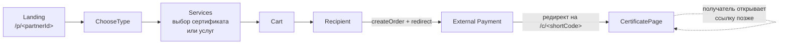

# Amplitude Analytics в Happybox

Документ описывает фактическую интеграцию Amplitude в проекте `happybox-link` после внедрения. Для расширения покрытия — следовать конвенциям из раздела [Расширение](#расширение).

---

## Контекст

**Happybox** — B2C-платформа подарочных сертификатов от партнёров (салоны, студии и т.п.). Текущий фронтенд (`gift.happybox.uz`) — это **step-flow без роутера**:

- Покупатель попадает на страницу партнёра по `https://gift.happybox.uz/p/<partnerId>`, выбирает тип подарка, услуги/сертификат, заполняет получателя, перенаправляется на платёжку.
- Получатель открывает `https://gift.happybox.uz/c/<shortCode>` — рендерится отдельная страница `CertificatePage` со статусом оплаты и составом сертификата.

**SDK:** [`@amplitude/unified`](https://www.npmjs.com/package/@amplitude/unified) — единый SDK, включает analytics + autocapture + session replay. Инициализирован один раз в `src/main.jsx` через обёртку `analytics.init()` с `autocapture: true`.

**Регион Amplitude:** **TBD — уточнить в Amplitude → Settings → Organization.** От региона зависит endpoint, на который SDK шлёт события (`api2.amplitude.com` для US, `api-eu.amplitude.com` для EU), и физическое местоположение хранилища данных (важно для GDPR / локальных требований). Если проект EU — в `analytics.init()` нужно явно передать `serverZone: 'EU'`:

```js
amplitude.initAll(apiKey, {
  serverZone: 'EU',
  analytics: { autocapture: true },
})
```

В текущей реализации `serverZone` не указан — SDK по умолчанию использует US. Если ваш Amplitude-проект в EU, нужно поправить.

---

## Флоу пользователя



Шаги `Activation` и `Success` (`src/components/Activation.jsx`, `src/components/Success.jsx`) в текущем флоу **недостижимы** — после `Recipient` пользователь редиректится на внешнюю платёжку и обратно попадает уже на `CertificatePage`. Файлы оставлены на случай возврата к встроенной оплате.

---

## Цели сбора

- Конверсия из визита партнёра в созданный заказ
- Сравнение готового сертификата vs собранного из услуг
- Воронка конструктора: где люди застревают
- Доходят ли сертификаты до получателей и попадает ли оплата
- Топ услуг/сертификатов

---

## Архитектура: одна точка входа — `analytics`

Файл **`src/lib/analytics.js`** — единственный публичный API:

- `analytics.init()` — вызывается **до рендера** в `src/main.jsx`. Если `VITE_AMPLITUDE_API_KEY` отсутствует, выводит warning в консоль и тихо обнуляет все последующие track-вызовы (приложение продолжает работать).
- `analytics.identifyUser(user)` — `setUserId` по телефону + установка user properties.
- `analytics.track*` — по методу на каждое событие.

**Не вызывать `amplitude.track` напрямую в компонентах.** Все события идут через обёртку — это даёт единое место для дедупликации, проверки, переименования.

---

## Конфигурация окружения

`.env`:

```
VITE_AMPLITUDE_API_KEY=ваш_ключ
```

`.env.example` — закоммичен в репо с пустым ключом. `.env` — в `.gitignore`.

В Vite переменные доступны через `import.meta.env.VITE_AMPLITUDE_API_KEY`.

---

## Список событий

Конвенции:
- **Имя события** — `Title Case` с пробелами: `Builder Started`
- **Properties** — `snake_case`: `certificate_id`, `total_amount`
- **Метод обёртки** — `camelCase`, начинается с `track`: `trackBuilderStarted()`

### Маппинг `giftType` → `certificate_type`

| `giftType` (внутреннее) | `certificate_type` (в Amplitude) | Описание |
|---|---|---|
| `cert`     | `ready`    | Готовый сертификат от партнёра |
| `services` | `custom`   | Сертификат, собранный через конструктор услуг |
| `deposit`  | `deposit`  | Пополнение депозита (UI пока disabled) |

### Покупательский флоу

| Метод | Событие | Properties | Где вызывается |
|---|---|---|---|
| `trackLandingViewed(partner)` | `Landing Viewed` | `partner_id`, `partner_name` | `src/components/Landing.jsx` — `useEffect` на mount |
| `trackGiftTypeChosen(giftType)` | `Gift Type Chosen` | `gift_type`, `certificate_type` | `src/App.jsx` — `ChooseType.onSelect` и confirm в `ClearCartModal` |
| `trackBuilderStarted()` | `Builder Started` | — | `src/App.jsx` — `useEffect` на (`step === 2`, `giftType === 'services'`) |
| `trackBuilderServiceAdded(svc, total, count)` | `Builder Service Added` | `service_id`, `service_name`, `service_price`, `service_category`, `current_total`, `services_count` | `src/App.jsx` — `toggleCart` при `giftType === 'services'` |
| `trackBuilderServiceRemoved(svc, total, count)` | `Builder Service Removed` | `service_id`, `service_name`, `current_total`, `services_count` | `src/App.jsx` — `toggleCart` при `giftType === 'services'` |
| `trackBuilderCompleted({ totalPrice, servicesCount })` | `Builder Completed` | `total_price`, `services_count` | `src/App.jsx` — `Services.onContinue` при `giftType === 'services'` |
| `trackBuilderAbandoned({ servicesCount, currentTotal })` | `Builder Abandoned` | `services_count`, `current_total` | `src/App.jsx` — `Services.onBack`, `ClearCartModal.onConfirm` (смена типа), `beforeunload` |
| `trackCartViewed(cart)` | `Cart Viewed` | `items_count`, `total_amount` | `src/components/Cart.jsx` — `useEffect` на mount |
| `trackRecipientInfoEntered()` | `Recipient Info Entered` | — | `src/App.jsx` — `Recipient.onContinue` (до `createOrder`) |
| `identifyUser({ name, phone })` | (identify-event) | user_id = digits(phone), user props: `name`, `phone` | `src/App.jsx` — `Recipient.onContinue` (до `createOrder`), по **отправителю** |
| `trackOrderCreated({ orderId, totalAmount, giftType, servicesCount, partnerId })` | `Order Created` | `order_id`, `total_amount`, `certificate_type`, `services_count`, `partner_id` | `src/App.jsx` — после `createOrder`, перед `window.location.assign` |
| `trackPurchaseFailed({ errorReason, step, giftType })` | `Purchase Failed` | `error_reason`, `step`, `certificate_type` | `src/App.jsx` — catch у `createOrder` |

### Жизненный цикл сертификата (получатель)

| Метод | Событие | Properties | Где вызывается |
|---|---|---|---|
| `trackCertificateOpenedByRecipient({ certificateId, timeSincePurchaseHours })` | `Certificate Opened by Recipient` | `certificate_id`, `time_since_purchase_hours` | `src/components/CertificatePage.jsx` — `useEffect` после загрузки `order`, дедуп через `localStorage` |
| `trackPaymentSubmittedByRecipient({ certificateId })` | `Payment Submitted by Recipient` | `certificate_id` | `src/components/CertificatePage.jsx` — клик «Я оплатил» |
| `trackPurchaseCompleted({ orderId, totalAmount, giftType, partnerId })` | `Purchase Completed` | `order_id`, `total_amount`, `certificate_type`, `partner_id` | `src/components/CertificatePage.jsx` — когда `order.isPaid === true`, дедуп через `localStorage` |
| `trackCertificateActivated({ certificateId, giftType, timeSincePurchaseHours })` | `Certificate Activated` | `certificate_id`, `certificate_type`, `time_since_purchase_hours` | `src/components/CertificatePage.jsx` — когда `order.isPaid === true`, дедуп через `localStorage` |

### Дедупликация одноразовых событий

`Certificate Opened by Recipient`, `Purchase Completed`, `Certificate Activated` стреляют по одному разу на `shortCode` через флаги в `localStorage`:

```
hb-analytics-opened:<shortCode>
hb-analytics-purchased:<shortCode>
hb-analytics-activated:<shortCode>
```

`Payment Submitted by Recipient` НЕ дедуплицируется — кнопка «Я оплатил» в UI сама блокируется через флаг `hb-payment-submitted:<shortCode>`, повторных кликов быть не может.

**Дедуп работает только в рамках одного устройства/браузера.** Если получатель открывает ссылку сначала на телефоне, потом на ноутбуке (или в другом браузере / в incognito) — события сработают на каждом устройстве заново. Это by design: метрика «уникальные открытия сертификата на устройство» полезнее, чем «открыл когда-либо вообще», и заодно даёт сигнал о возврате к ссылке. При построении воронок в Amplitude учитывать это — фильтровать по `user_id` или агрегировать по `certificate_id`, а не считать сырые counts.

---

## Известные ограничения

### `Purchase Completed` зависит от визита получателя на `CertificatePage`

Событие фиксируется только тогда, когда **получатель открывает `/c/<shortCode>`** и при этом бекенд уже отметил `order.isPaid === true`. Если оплата прошла, но получатель так и не зашёл по ссылке — заказ останется висеть в воронке как `Order Created` без `Purchase Completed`.

Последствия:
- Метрика «конверсия из заказа в оплату» в Amplitude **занижена**: реальная доля оплат больше, чем то, что покажет воронка.
- Метрика «среднее время от заказа до оплаты» считается по моменту визита получателя на страницу, а не по моменту прихода денег — может быть смещена на часы/дни.

Правильное решение — **слать `Purchase Completed` с бекенда** через Amplitude HTTP API ([Batch Event Upload](https://amplitude.com/docs/apis/analytics/batch-event-upload)) на webhook от платёжного провайдера. Это даст:
- 100% покрытие оплат, независимо от поведения получателя
- Точный timestamp оплаты (а не визита)
- Возможность дедуплицировать по `order_id` на стороне Amplitude

До этого момента — относиться к фронтенд-метрике `Purchase Completed` как к приближению, а не как к источнику истины. Для расчётов по выручке использовать данные из бекенда напрямую, не из Amplitude.

### `Builder Abandoned` через `beforeunload` ненадёжен

Событие в `beforeunload`-листенере (`src/App.jsx`) шлётся best-effort: браузеры всё активнее ограничивают сетевые запросы при закрытии вкладки, особенно на мобильных. Часть событий может не дойти.

Транспорт SDK (`fetch keepalive` / `sendBeacon` под капотом у `@amplitude/unified`) обычно справляется на десктопе, но на iOS Safari при свайпе вкладки доставка близка к 0%. Метрика `Builder Abandoned` — нижняя оценка, реальный отток больше.

### Anonymous user до шага `Recipient`

`identifyUser` вызывается только на шаге `Recipient` (по телефону отправителя). До этого пользователь анонимен — Amplitude трекает его по `device_id`. Если человек прошёл воронку до конца на одном устройстве, потом вернулся на другом и с того же телефона оплатил — это будут два разных `device_id` до `identify` и один `user_id` после. В отчётах учитывать `user_id`, а не `device_id`, для бизнес-метрик повторных покупок.

---

## Что было осознанно скипнуто

- `Search Performed` / `Category Viewed` — поиска и категорий в UI нет.
- `Sign Up Completed` / `Login` / `reset` — регистрации и логаута в продукте нет, пользователь анонимен до шага «Получатель».
- `Certificate Viewed` per-card — текущий каталог это плоский список карточек без detail-страницы, событие на каждой карточке создаст шум. Добавить, когда появится экран отдельной карточки.
- `Builder Service Viewed` — то же самое, услуги все на одной странице списком.
- `Certificate Redeemed` (использование услуги получателем) — пока нет UI/интеграции с провайдером услуги.
- Удаление из корзины на экране `Cart` (`removeFromCart`) — не трекается, чтобы не дублировать с `Builder Service Removed` со страницы `Services`.

Когда появятся соответствующие фичи — добавлять события в `src/lib/analytics.js` и расставлять по правилам ниже.

---

## User properties

`identifyUser` вызывается на шаге `Recipient` **по данным отправителя** (того, кто платит), не получателя. Это сохраняет коэрентность пользователя между заказами в Amplitude:

- `user_id` = цифры из `sender.phone` (только если ≥ 11 цифр)
- user properties: `name`, `phone`

Получатель ≠ пользователь Amplitude. Открытие сертификата получателем фиксируется как событие, но `userId` в этот момент не выставляется.

---

## Структура файлов после внедрения

```
src/
  lib/
    analytics.js                 ← обёртка над @amplitude/unified
  main.jsx                       ← analytics.init() до рендера
  App.jsx                        ← gift type chosen, builder lifecycle,
                                   recipient info, order created/failed,
                                   identifyUser, beforeunload abandonment
  components/
    Landing.jsx                  ← Landing Viewed
    ChooseType.jsx               ← (тип передаётся наверх в App.jsx)
    Services.jsx                 ← (события навешены через onToggle/onContinue/onBack из App.jsx)
    Cart.jsx                     ← Cart Viewed
    Recipient.jsx                ← (события навешены через onContinue из App.jsx)
    CertificatePage.jsx          ← Certificate Opened, Payment Submitted,
                                   Purchase Completed, Certificate Activated
.env                             ← VITE_AMPLITUDE_API_KEY (в .gitignore)
.env.example                     ← пустой VITE_AMPLITUDE_API_KEY
docs/
  analytics.md                   ← этот документ
```

---

## Тестирование

1. `npm run dev`
2. DevTools → Network → фильтр `amplitude` — POST'ы должны идти на `api2.amplitude.com` или `api-eu.amplitude.com` (в зависимости от региона API-ключа).
3. Amplitude → **User Look-Up** или **Live Stream**.
4. Сценарии:
   - **Готовый сертификат:** `/p/<id>` → Подарить → «Готовый сертификат» → выбор → корзина → получатель → редирект на оплату.
   - **Конструктор:** `/p/<id>` → Подарить → «Собрать из услуг» → добавление/удаление услуг → корзина → получатель → редирект.
   - **Конструктор abandon:** зайти, добавить услуги, нажать «назад» / закрыть вкладку → должен прилететь `Builder Abandoned`.
   - **Получатель:** открыть `/c/<shortCode>` → `Certificate Opened by Recipient`. Если уже оплачен — `Purchase Completed` + `Certificate Activated`. Клик «Я оплатил» → `Payment Submitted by Recipient`.
5. Проверить в Live Stream, что events приходят в течение 1-2 минут со всеми ожидаемыми properties.

### Режим отладки

Добавить в `src/lib/analytics.js` в вызов `initAll`:

```javascript
import { Types } from '@amplitude/unified'
amplitude.initAll(apiKey, {
  analytics: {
    autocapture: true,
    logLevel: Types.LogLevel.Debug,
  },
})
```

---

## Расширение

### Как добавить новое событие

1. Добавить метод в `src/lib/analytics.js` по шаблону:
   ```js
   trackSomethingHappened({ foo, bar } = {}) {
     track('Something Happened', { foo, bar_count: bar })
   }
   ```
   - Имя события — `Title Case`.
   - Properties — `snake_case`.
   - Аргументы метода — destructured object с `camelCase`-ключами; функция `clean()` уберёт `undefined`/`null`.

2. Вызвать в нужном месте: предпочтительно в `App.jsx` (если событие связано с навигацией/state) либо в `useEffect` компонента (если событие на mount).

3. Не дублировать autocapture — он сам ловит `[Amplitude] Page Viewed`, клики, скроллы. Добавлять кастомные события только если они дают семантику, которой autocapture не покроет.

4. **Не передавать чувствительные данные** в properties: пароли, номера карт, CVV, паспортные данные, полные ФИО получателя без бизнес-нужды.

### Версионирование

Если структура события меняется несовместимо — заводить `Event Name v2`, не править старое. Иначе исторические данные становятся непригодны.

### User properties покупателя (TODO, когда будет бекенд)

Когда появится возможность связать заказы пользователя — расширить `identifyUser` после `Order Created`:

- `total_purchases` (счётчик)
- `last_purchase_date`
- `favorite_category`

Это сильно улучшает сегментацию и retention-метрики.

### Чек-лист перед мерджем нового события

- [ ] Метод добавлен в `src/lib/analytics.js` с конвенциями имени (Title Case event, snake_case props, camelCase method)
- [ ] Имя события и properties задокументированы в `docs/analytics.md` (в подходящей таблице раздела «Список событий»)
- [ ] Событие протестировано локально и видно в Amplitude → Live Stream с правильными properties
- [ ] Если событие одноразовое (типа `Purchase Completed`) — настроена дедупликация (localStorage + комментарий в коде)
- [ ] Properties не содержат чувствительных данных (пароли, номера карт, CVV, паспорт, полный адрес)
- [ ] Если событие может срабатывать в `beforeunload`/при уходе со страницы — учтено в разделе «Известные ограничения»
- [ ] Если меняется структура существующего события — заведено `Event Name v2`, старое не редактируется
- [ ] Если событие зависит от состояния, которое появляется не сразу (как `order.isPaid` на `CertificatePage`) — описана зависимость в документе

---

## Что НЕ делать

- Не настраивать дашборды/воронки в Amplitude в этом коммите — это отдельный этап после сбора первичных данных.
- Не подключать Amplitude Experiment (A/B-тесты) без отдельной задачи.
- Не передавать чувствительные данные в properties.
- Не трекать `[Amplitude] Page Viewed` руками — autocapture это уже делает.
- Не вызывать `amplitude.track` напрямую в компонентах — всё через `analytics.*`.
